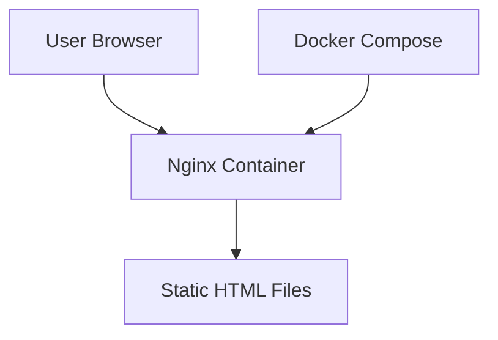
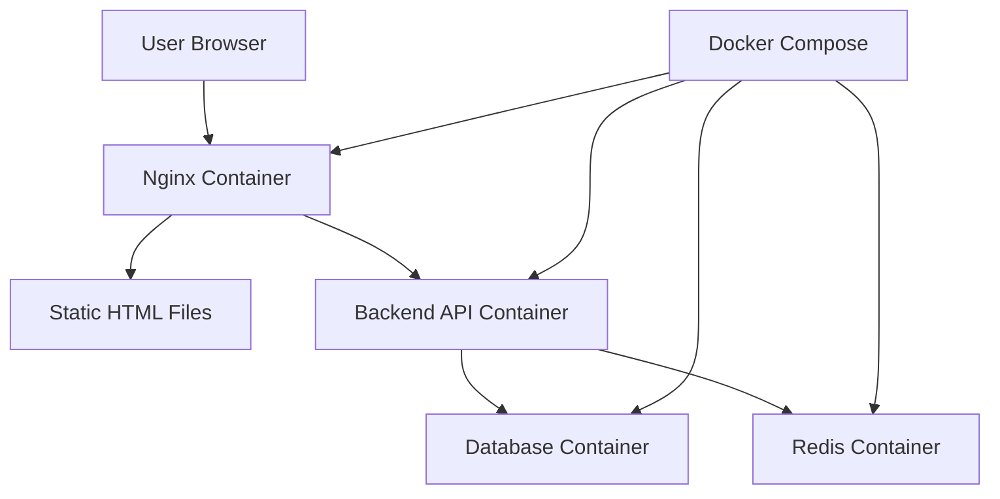

# Design Document

## Overview

This design document outlines the architecture for a minimal extensible web application foundation. The system serves a static welcome page using Nginx in a Docker container, providing the simplest possible starting point for future feature development.

## Architecture

The system follows a minimal containerized architecture for initial implementation:

### Current Implementation Scope (Phase 1)


**Components to be implemented in this phase:**
1. **Nginx Web Server**: Serves static HTML content
2. **Docker Container**: Provides consistent deployment environment  
3. **Static Content**: HTML and CSS files for the welcome page

### Future Extension Architecture (Phase 2+)


**Components for future implementation:**
- Backend API Container (Phase 2)
- Database Container (Phase 2)
- Redis/Cache Container (Phase 3)
- Additional middleware services (Phase 3+)

## Components and Interfaces

### Phase 1 Implementation (Current)

#### Web Server Component
- **Technology**: Nginx (Alpine Linux base image for minimal size)
- **Purpose**: Serve static HTML files to web browsers
- **Port**: 80 (internal), mapped to 8080 (host)
- **Configuration**: Basic nginx.conf for static file serving
- **Status**: ✅ To be implemented in Phase 1

#### Static Content Component
- **Files**: 
  - `index.html` - Welcome page
  - `style.css` - Basic styling
- **Location**: `/usr/share/nginx/html/` (inside container)
- **Content**: Simple welcome message with project branding
- **Status**: ✅ To be implemented in Phase 1

#### Container Infrastructure
- **Base Image**: `nginx:alpine` (lightweight, secure)
- **Orchestration**: Docker Compose for single-command deployment
- **Command**: Uses modern `docker compose` command (not legacy `docker-compose`)
- **Volumes**: Static files mounted from host to container
- **Networking**: Single container with port mapping (extensible to multi-container network)
- **Status**: ✅ To be implemented in Phase 1

### Phase 2+ Extensions (Future)

#### Backend API Component
- **Technology**: TBD (Node.js/Express, Python/FastAPI, etc.)
- **Purpose**: Handle dynamic requests and business logic
- **Integration**: Nginx reverse proxy configuration
- **Status**: 🔄 Future implementation

#### Database Component
- **Technology**: TBD (PostgreSQL, MySQL, etc.)
- **Purpose**: Persistent data storage
- **Integration**: Backend API connection via Docker network
- **Status**: 🔄 Future implementation

#### Cache/Session Component
- **Technology**: Redis or similar
- **Purpose**: Session management and caching
- **Integration**: Backend API connection
- **Status**: 🔄 Future implementation

## Data Models

### Phase 1 Implementation (Current)

#### Static Content Structure
```
/static/
├── index.html          # Main welcome page ✅
├── style.css          # Basic CSS styling ✅
└── assets/            # Future assets directory 🔄
    └── images/        # Image files (placeholder) 🔄
```

#### Configuration Structure
```
/
├── docker-compose.yml  # Container orchestration ✅
├── nginx.conf         # Nginx configuration ✅
├── static/            # Static content directory ✅
└── README.md          # Setup instructions ✅
```

### Phase 2+ Extensions (Future)

#### Extended Directory Structure
```
/
├── docker-compose.yml  # Extended with multiple services 🔄
├── nginx.conf         # Extended with reverse proxy 🔄
├── static/            # Static content directory ✅
├── backend/           # Backend API code 🔄
├── database/          # Database initialization scripts 🔄
├── .env.example       # Environment variables template 🔄
└── README.md          # Extended setup instructions 🔄
```

**Legend:**
- ✅ To be implemented in Phase 1
- 🔄 Future implementation (Phase 2+)

## Extensibility Architecture

### Future Module Integration Strategy

The current minimal architecture is designed with extensibility in mind:

**Database Integration:**
- Add database service to `docker-compose.yml`
- Create isolated database container (PostgreSQL, MySQL, etc.)
- Use Docker networks for secure inter-container communication
- Environment variables for database connection configuration

**Backend API Integration:**
- Add backend service container to `docker-compose.yml`
- Configure Nginx as reverse proxy for API endpoints
- Maintain static file serving while adding dynamic endpoints
- Use Docker networks for frontend-backend communication

**Middleware and Services:**
- Each new service becomes an independent Docker container
- Services communicate through Docker networks or message queues
- Configuration managed through environment variables and volumes
- Hot-swappable services without affecting core static serving

**Example Future Architecture:**


**Extension Points:**
1. **docker-compose.yml**: Add new services as containers
2. **nginx.conf**: Configure reverse proxy rules for new endpoints
3. **Environment Variables**: Service configuration and secrets
4. **Docker Networks**: Secure inter-service communication
5. **Volumes**: Persistent data and shared resources

This approach ensures that:
- Each module remains isolated and independently deployable
- The core static serving functionality is never disrupted
- New features can be added without modifying existing code
- Services can be scaled independently
- Development and production environments remain consistent

## Correctness Properties

*A property is a characteristic or behavior that should hold true across all valid executions of a system-essentially, a formal statement about what the system should do. Properties serve as the bridge between human-readable specifications and machine-verifiable correctness guarantees.*

### Property 1: Welcome page content delivery
*For any* HTTP GET request to the root URL, the response should contain HTML content with welcome page elements (title, welcome message, and proper HTML structure)
**Validates: Requirements 1.1**

### Property 2: HTML and CSS content structure
*For any* HTTP response from the web application, if it contains HTML content, it should include proper HTML tags and CSS styling references
**Validates: Requirements 1.2**

### Property 3: Localhost accessibility
*For any* properly started container instance, HTTP requests to localhost on the configured port should return successful responses (HTTP 200 status)
**Validates: Requirements 2.3**

## Error Handling

### HTTP Error Responses
- **404 Not Found**: Return custom 404 page for non-existent resources
- **500 Internal Server Error**: Log errors and return generic error page
- **Connection Errors**: Nginx handles connection timeouts gracefully

### Container Error Handling
- **Startup Failures**: Docker Compose will report container startup issues
- **Port Conflicts**: Clear error messages for port binding conflicts
- **File Mount Errors**: Validation of static file availability

## Testing Strategy

### Dual Testing Approach
The system will use both unit tests and property-based tests for comprehensive coverage:

**Unit Tests:**
- Specific examples of HTTP requests and expected responses
- Container startup and shutdown procedures
- Static file serving for known files
- Error conditions (missing files, invalid requests)

**Property-Based Tests:**
- Universal properties across all HTTP requests
- Container behavior across different startup conditions
- Response format consistency across all valid requests
- Minimum 100 iterations per property test

**Property Test Configuration:**
- Use a lightweight HTTP testing framework
- Each property test references its design document property
- Tag format: **Feature: extensible-web-app, Property {number}: {property_text}**
- Focus on HTTP response validation and container behavior

**Testing Tools:**
- HTTP client library for request testing
- Docker API for container state validation
- HTML parsing library for content structure validation