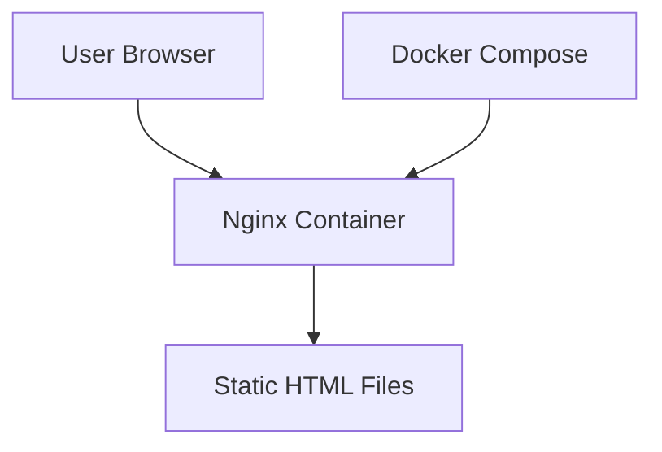
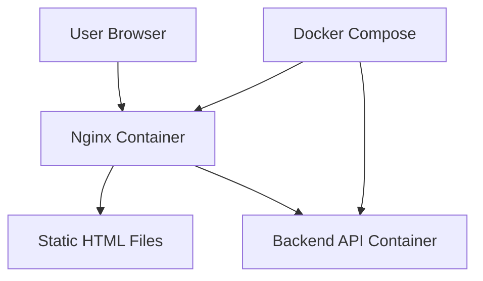
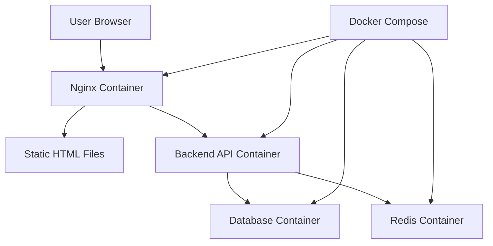
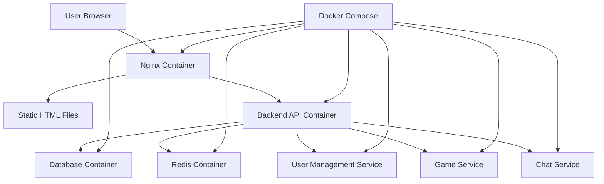
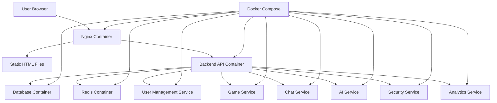

# Design Document

## Overview

This design document outlines the architecture for a minimal extensible web application foundation. The system serves a static welcome page using Nginx in a Docker container, providing the simplest possible starting point for future feature development.

## Architecture

The system follows a minimal containerized architecture for initial implementation:

### Current Implementation Scope (Phase 1)


**Components to be implemented in this phase:**
1. **Nginx Web Server**: Serves static HTML content
2. **Docker Container**: Provides consistent deployment environment  
3. **Static Content**: HTML and CSS files for the welcome page

### Future Extension Architecture (Phase 2+)

#### Phase 2: Backend API Foundation


**Phase 2 Components:**
- Backend API Container (Node.js/Express or Python/FastAPI)
- API endpoint routing through Nginx reverse proxy
- Basic REST API structure for future features

#### Phase 3: Data Layer Integration


**Phase 3 Components:**
- Database Container (PostgreSQL for robust data management)
- Redis Container (session management and caching)
- Database schema and migration system
- Session management and authentication foundation

#### Phase 4: Core ft_transcendence Modules


**Phase 4 Components (14+ points target):**
- **User Management Service** (Major: 2pts)
  - Standard user authentication and profiles
  - Avatar upload and friend system
  - Online status tracking
- **Game Service** (Major: 2pts)
  - Web-based game implementation (Pong, Chess, etc.)
  - Real-time multiplayer support
- **Chat Service** (Major: 2pts)
  - Basic chat system for user interaction
  - Real-time messaging with WebSockets
- **Web Framework Integration** (Major: 2pts)
  - Frontend framework (React/Vue) + Backend framework
- **Database ORM** (Minor: 1pt)
  - Object-relational mapping for data access

**Phase 4 Total: 9 points**

#### Phase 5: Advanced Features and Optimization


**Phase 5 Components (Additional 5+ points):**
- **AI Service** (Major: 2pts)
  - AI opponent for games
  - Machine learning recommendations
- **Security Service** (Major: 2pts)
  - WAF/ModSecurity implementation
  - HashiCorp Vault for secrets management
- **Analytics Service** (Minor: 1pt)
  - User activity analytics and insights
- **Advanced Chat Features** (Minor: 1pt)
  - Enhanced chat with game invitations
  - User blocking and advanced features

**Phase 5 Total: 6 points**

#### Phase 6: Specialized Modules (Future Expansion)
**Additional modules based on project direction:**
- **Gaming Enhancements**: Tournament system, spectator mode, game customization
- **DevOps Integration**: ELK stack, Prometheus/Grafana monitoring
- **Accessibility**: WCAG compliance, internationalization
- **Advanced Features**: PWA, SSR, file upload system
- **Blockchain Integration**: Tournament score storage on blockchain

## Components and Interfaces

### Phase 1 Implementation (Current)

#### Web Server Component
- **Technology**: Nginx (Alpine Linux base image for minimal size)
- **Purpose**: Serve static HTML files to web browsers
- **Port**: 80 (internal), mapped to 8080 (host)
- **Configuration**: Basic nginx.conf for static file serving
- **Status**: ✅ To be implemented in Phase 1

#### Static Content Component
- **Files**: 
  - `index.html` - Welcome page
  - `style.css` - Basic styling
- **Location**: `/usr/share/nginx/html/` (inside container)
- **Content**: Simple welcome message with project branding
- **Status**: ✅ To be implemented in Phase 1

#### Container Infrastructure
- **Base Image**: `nginx:alpine` (lightweight, secure)
- **Orchestration**: Docker Compose for single-command deployment
- **Command**: Uses modern `docker compose` command (not legacy `docker-compose`)
- **Volumes**: Static files mounted from host to container
- **Networking**: Single container with port mapping (extensible to multi-container network)
- **Status**: ✅ To be implemented in Phase 1

### Phase 2+ Extensions (Future)

#### Phase 2: Backend API Component
- **Technology**: Node.js/Express or Python/FastAPI
- **Purpose**: Handle dynamic requests and business logic
- **Integration**: Nginx reverse proxy configuration
- **Endpoints**: RESTful API structure for future features
- **Status**: 🔄 Phase 2 implementation

#### Phase 3: Database Component
- **Technology**: PostgreSQL (robust, ACID-compliant)
- **Purpose**: Persistent data storage for users, games, chat
- **Integration**: Backend API connection via Docker network
- **Schema**: User management, game data, chat messages
- **Status**: 🔄 Phase 3 implementation

#### Phase 3: Cache/Session Component
- **Technology**: Redis
- **Purpose**: Session management, caching, real-time data
- **Integration**: Backend API connection for session storage
- **Features**: User sessions, game state caching, chat message queuing
- **Status**: 🔄 Phase 3 implementation

#### Phase 4: Microservices Architecture
- **User Management Service**: Authentication, profiles, friends
- **Game Service**: Game logic, matchmaking, real-time gameplay
- **Chat Service**: Real-time messaging, user interactions
- **Status**: 🔄 Phase 4 implementation

#### Phase 5: Advanced Services
- **AI Service**: Game opponents, recommendations, content moderation
- **Security Service**: WAF, secrets management, advanced authentication
- **Analytics Service**: User behavior tracking, performance metrics
- **Status**: 🔄 Phase 5 implementation

## Data Models

### Phase 1 Implementation (Current)

#### Static Content Structure
```
/static/
├── index.html          # Main welcome page ✅
├── style.css          # Basic CSS styling ✅
└── assets/            # Future assets directory 🔄
    └── images/        # Image files (placeholder) 🔄
```

#### Configuration Structure
```
/
├── docker-compose.yml  # Container orchestration ✅
├── nginx.conf         # Nginx configuration ✅
├── static/            # Static content directory ✅
└── README.md          # Setup instructions ✅
```

### Phase 2+ Extensions (Future)

#### Extended Directory Structure by Phase

**Phase 2: Backend API**
```
/
├── docker-compose.yml  # Extended with API service 🔄
├── nginx.conf         # Extended with reverse proxy 🔄
├── static/            # Static content directory ✅
├── backend/           # Backend API code 🔄
│   ├── src/          # API source code
│   ├── package.json  # Dependencies
│   └── Dockerfile    # API container config
├── .env.example       # Environment variables template 🔄
└── README.md          # Extended setup instructions 🔄
```

**Phase 3: Data Layer**
```
/
├── docker-compose.yml  # Extended with DB and Redis 🔄
├── nginx.conf         # Complete reverse proxy config 🔄
├── static/            # Static content directory ✅
├── backend/           # Backend API code 🔄
├── database/          # Database initialization scripts 🔄
│   ├── init.sql      # Database schema
│   ├── migrations/   # Schema migrations
│   └── seeds/        # Test data
├── redis/             # Redis configuration 🔄
├── .env.example       # Complete environment config 🔄
└── README.md          # Full setup instructions 🔄
```

**Phase 4: Microservices**
```
/
├── docker-compose.yml  # Full microservices stack 🔄
├── nginx.conf         # Complete routing configuration 🔄
├── static/            # Static content directory ✅
├── services/          # Microservices directory 🔄
│   ├── user-management/
│   ├── game-service/
│   ├── chat-service/
│   └── shared/       # Shared utilities
├── database/          # Database scripts 🔄
├── redis/             # Redis configuration 🔄
├── monitoring/        # Logging and monitoring 🔄
├── .env.example       # Production-ready config 🔄
└── README.md          # Complete documentation 🔄
```

**Legend:**
- ✅ To be implemented in Phase 1
- 🔄 Future implementation (Phase 2+)

## Extensibility Architecture

### Phase-by-Phase Implementation Strategy

**Phase 2: Backend API Foundation**
- Add backend service to `docker-compose.yml`
- Configure Nginx as reverse proxy for `/api/*` endpoints
- Implement basic REST API structure
- Maintain static file serving for frontend

**Phase 3: Data Layer Integration**
- Add PostgreSQL and Redis services to `docker-compose.yml`
- Implement database connection and ORM
- Add session management and caching
- Create database migration system

**Phase 4: Core ft_transcendence Features**
- Implement user management (authentication, profiles, friends)
- Add game service (real-time multiplayer game)
- Implement chat service (WebSocket-based messaging)
- Achieve 14+ points for ft_transcendence requirements

**Phase 5: Advanced Features**
- Add AI service for game opponents
- Implement security hardening (WAF, Vault)
- Add analytics and monitoring
- Optimize performance and scalability

### Module Integration Strategy

**Service Independence:**
- Each service runs in its own Docker container
- Services communicate through well-defined APIs
- Database access is service-specific (no shared database access)
- Configuration is environment-variable driven

**Nginx Routing Strategy:**
```nginx
# Static content (Phase 1)
location / {
    root /usr/share/nginx/html;
}

# API endpoints (Phase 2+)
location /api/ {
    proxy_pass http://backend-api:3000;
}

# WebSocket endpoints (Phase 4+)
location /ws/ {
    proxy_pass http://chat-service:3001;
    proxy_http_version 1.1;
    proxy_set_header Upgrade $http_upgrade;
    proxy_set_header Connection "upgrade";
}
```

**Docker Compose Evolution:**
```yaml
# Phase 1: Static only
services:
  nginx:
    image: nginx:alpine
    ports:
      - "8080:80"

# Phase 2: + Backend API
services:
  nginx: # ... existing config
  backend-api:
    build: ./backend
    environment:
      - NODE_ENV=production

# Phase 3: + Database & Redis
services:
  # ... existing services
  postgres:
    image: postgres:15-alpine
    environment:
      - POSTGRES_DB=transcendence
  redis:
    image: redis:7-alpine

# Phase 4+: + Microservices
services:
  # ... existing services
  user-service:
    build: ./services/user-management
  game-service:
    build: ./services/game-service
  chat-service:
    build: ./services/chat-service
```

### ft_transcendence Module Mapping

**Required 14+ Points Achievement:**
- **Phase 4 Core (9 points)**:
  - Web frameworks (frontend + backend): 2 points
  - User Management (standard): 2 points
  - Web-based game: 2 points
  - User interaction (chat + profiles + friends): 2 points
  - ORM usage: 1 point

- **Phase 5 Advanced (5+ points)**:
  - AI opponent: 2 points
  - WAF/ModSecurity + Vault: 2 points
  - User activity analytics: 1 point

**Extension Points for Additional Modules:**
1. **Gaming**: Tournament system, spectator mode, game customization
2. **DevOps**: ELK stack, Prometheus/Grafana monitoring
3. **Accessibility**: WCAG compliance, internationalization
4. **Advanced Web**: PWA, SSR, file upload system
5. **Blockchain**: Tournament score storage

This approach ensures that:
- Each phase delivers working, testable functionality
- The core static serving functionality is never disrupted
- New features can be added without modifying existing code
- Services can be scaled independently
- ft_transcendence requirements are systematically addressed
- Development and production environments remain consistent

## Correctness Properties

*A property is a characteristic or behavior that should hold true across all valid executions of a system-essentially, a formal statement about what the system should do. Properties serve as the bridge between human-readable specifications and machine-verifiable correctness guarantees.*

### Property 1: Welcome page content delivery
*For any* HTTP GET request to the root URL, the response should contain HTML content with welcome page elements (title, welcome message, and proper HTML structure)
**Validates: Requirements 1.1**

### Property 2: HTML and CSS content structure
*For any* HTTP response from the web application, if it contains HTML content, it should include proper HTML tags and CSS styling references
**Validates: Requirements 1.2**

### Property 3: Localhost accessibility
*For any* properly started container instance, HTTP requests to localhost on the configured port should return successful responses (HTTP 200 status)
**Validates: Requirements 2.3**

### Property 4: API health check response
*For any* HTTP GET request to `/api/health`, the response should contain valid JSON with health status information and return HTTP 200 status
**Validates: Requirements 3.3**

### Property 5: API request routing and data integrity
*For any* HTTP request to `/api/*` endpoints, the request should be properly routed to the backend service and the response data should be forwarded without modification
**Validates: Requirements 3.2, 4.1, 4.4**

### Property 6: Static content preservation
*For any* non-API HTTP request (not starting with `/api/`), the response should serve static content correctly, maintaining all existing functionality
**Validates: Requirements 3.4, 4.2**

### Property 7: API service error handling
*For any* API request when the backend service is unavailable, the system should return appropriate error responses (5xx status codes) without affecting static content serving
**Validates: Requirements 4.3**

## Error Handling

### HTTP Error Responses
- **404 Not Found**: Return custom 404 page for non-existent resources
- **500 Internal Server Error**: Log errors and return generic error page
- **Connection Errors**: Nginx handles connection timeouts gracefully

### Container Error Handling
- **Startup Failures**: Docker Compose will report container startup issues
- **Port Conflicts**: Clear error messages for port binding conflicts
- **File Mount Errors**: Validation of static file availability

## Testing Strategy

### Dual Testing Approach
The system will use both unit tests and property-based tests for comprehensive coverage:

**Unit Tests:**
- Specific examples of HTTP requests and expected responses
- Container startup and shutdown procedures
- Static file serving for known files
- Error conditions (missing files, invalid requests)

**Property-Based Tests:**
- Universal properties across all HTTP requests
- Container behavior across different startup conditions
- Response format consistency across all valid requests
- Minimum 100 iterations per property test

### Multi-Environment Testing Support

**Development Environment (Local Development):**
- **Requirements**: PowerShell only (Windows)
- **Capabilities**: Configuration validation, deployment readiness verification
- **Tools**: PowerShell scripts for file validation and configuration checking
- **Purpose**: Quick validation without Docker/npm dependencies
- **Files**: 
  - `tests/validate-nginx-config.ps1`
  - `tests/validate-deployment-config.ps1`
  - `tests/property-tests/Test-LocalhostAccessibility.ps1`

**Production Environment (CI/CD and Server Deployment):**
- **Requirements**: Docker, Docker Compose, npm, Node.js, bash (Linux/Unix)
- **Capabilities**: Full container testing, comprehensive property-based testing
- **Tools**: Node.js with fast-check library, bash scripts, Docker API
- **Purpose**: Complete end-to-end validation with actual containers
- **Files**:
  - `tests/test-nginx-config.sh`
  - `tests/test-deployment.sh`
  - `tests/test-deployment-lenient.sh`
  - `tests/property-tests/localhost-accessibility.test.js`
  - `tests/property-tests/test-localhost-accessibility*.sh`

**Environment-Specific File Strategy:**
- **No Duplication**: PowerShell files are for development only, bash/npm files are for production only
- **Clear Separation**: Each environment has distinct tooling and file sets
- **No Cross-Platform Files**: Avoid maintaining both PowerShell and bash versions of the same functionality

**Property Test Configuration:**
- **Development**: PowerShell-based simulation mode (no actual HTTP requests)
- **Production**: Node.js with fast-check library for comprehensive property testing
- Each property test references its design document property
- Tag format: **Feature: extensible-web-app, Property {number}: {property_text}**
- Focus on HTTP response validation and container behavior